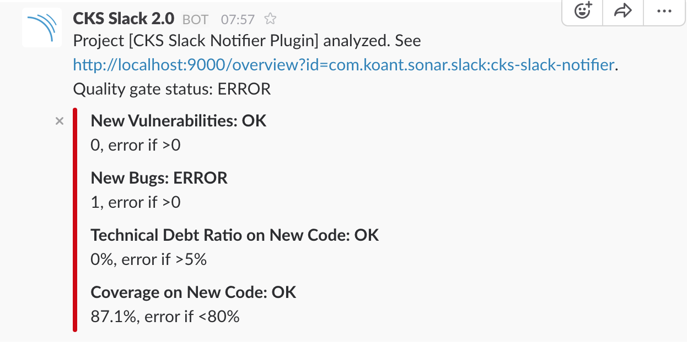
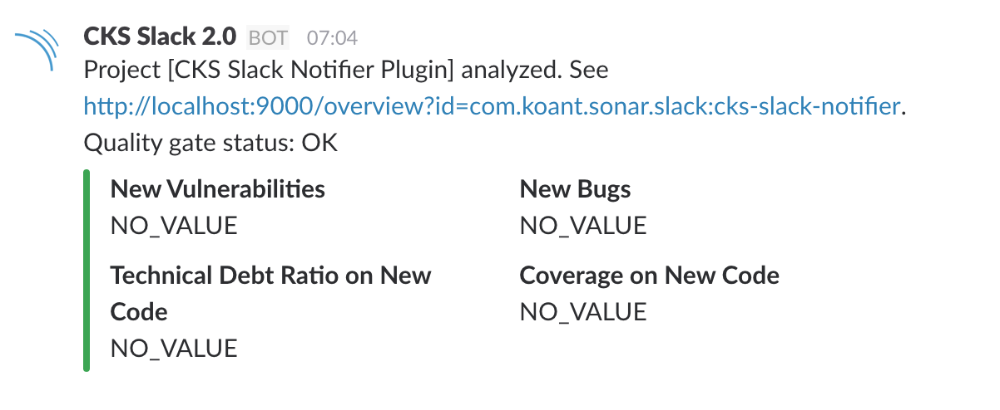

# Warning

This project is a fork of the original work from https://github.com/kogitant/sonar-slack-notifier-plugin.
I made modifications to keep it working for the latest versions of SonarQube.

## Pre-requisites

The actual version is compiled for *SonarQube v8.0 and JDK 11*.

# CKS Sonar Slack Notifier Plugin
SonarQube plugin for sending notifications to Slack

This plugin sends a Slack message of project analysis outcome to congired project specific slack channel.
The plugin uses Incoming Web Hook as the integration mechanism with Slack.

# Install
The plugin must be placed in *SONAR_HOME/extensions/plugins* directory and SonarQube must be restarted.

## Using latest release
You can find the latest release from https://github.com/sleroy/sonar-slack-notifier-plugin/releases/ page.
Download the 

## From sources
To build the plugin simply run
```
mvn clean package
```


# Configuration
After the plugin has been installed, you need to configure it.
Although SonarQube offers project level configurations for some plugins, they cannot be used with this plugin because it runs in the "server side", and only sees the global settings.

As administrator, go to the general settings and configure the Sonar instance URL:


A new category Slack appears in the left menu:


Under it you can find the CKS Slack Notifier plugin configurations:


In the above example there is a Project Key to Slack Channel configuration for an example project.
You can override the globally  defined web-hook, if you like. Example use case: You want a project to notify a different Slack team.  
The project key of any SonarQube project can be found in the project page (bottom right corner):


## Wildcard support
The project key supports wildcards at the end. See https://github.com/sleroy/sonar-slack-notifier-plugin/issues/2

## Only send notification when Quality Gate fails
Notifications can be sent for all Quality Gate statuses, or just for WARNING/ERROR statuses. See https://github.com/kogitant/sonar-slack-notifier-plugin/issues/1 
 
# Example messages posted to Slack
## New bug introduced


## All good


# Works with
* Tested with SonarQube 7.2 and 7.3 against Slack on 23.02.2019

# Inspired by
* https://github.com/astrebel/sonar-slack-notifier-plugin
* https://github.com/dbac2002/sonar-hipchat-plugin

# Benefits from
* https://github.com/seratch/jslack

# SonarQube Plugin Development guides
* http://docs.sonarqube.org/display/DEV/Adding+Hooks
* http://docs.sonarqube.org/display/DEV/Build+plugin

# Slack webhook integration and message formatting guides
 * https://api.slack.com/custom-integrations
 * https://api.slack.com/docs/attachments#message_formatting
 * https://api.slack.com/docs/attachments


# Analyzing this project with unit test and integration test coverage
```
    mvn clean jacoco:prepare-agent install -DskipITs=true
    mvn jacoco:prepare-agent-integration failsafe:integration-test
    mvn sonar-maven-plugin:sonar -Dsonar.host.url=http://localhost:9000
```
